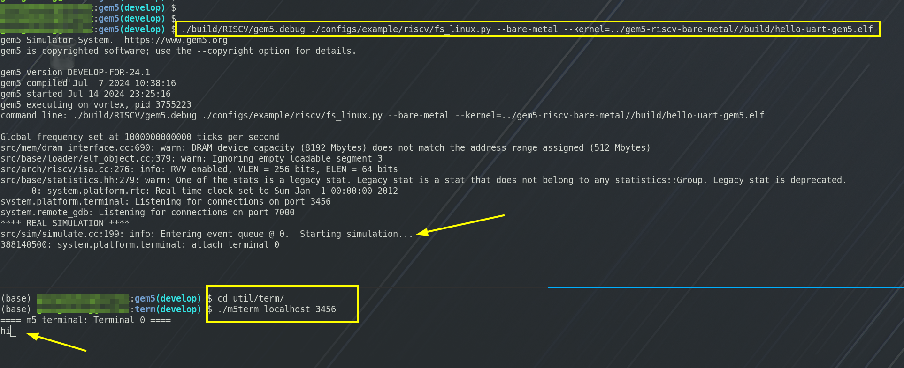

# RISC-V for gem5

The `src` directory in this branch contains the code necessary to follow along with [RISC-V from scratch 3: Writing a UART driver in assembly (1 / 3)](https://twilco.github.io/riscv-from-scratch/2019/07/08/riscv-from-scratch-3.html).  In this post, we begin implementation of a driver for the `virt` onboard UART, discussing the basics of UART functionality and additional linker script and devicetree layout exploration along the way.

You'll also notice a directory in this repository called `work`, which can be used as your personal working directory as you progress through the series, allowing you to move from branch to branch and pull from or compare with `src` as you please.

If you have any questions, comments, or corrections, feel free to [open an issue](https://github.com/twilco/twilco.github.io/issues) or leave a comment on the posts themselves.


## usage

### dir structure

```bahs
├── gem5
│   └── build
│       └── gem5.opt
└── gem5-riscv-bare-metal
    └── build
        └── hello-uart-gem5.elf
```

### build testcase

NOTE: set RISCV to riscvtoolchain

```bash
$ cd gem5-riscv-bare-metal

$ make

$ ls -l build/
```

### gem5

```bash
$ cd gem5
$ scons -sQ -j$(nproc) build/RISCV/gem5.debug

$ ./build/RISCV/gem5.debug ./configs/example/riscv/fs_linux.py --bare-metal --kernel=../gem5-riscv-bare-metal/build/hello-uart-gem5.elf

# new ternimal/shell
$ cd util/term

$ make

$ ./m5term localhost 3456
```




## reference

1. [RISC-V from scratch 3](https://twilco.github.io/riscv-from-scratch/2019/07/08/riscv-from-scratch-3.html)
1. [RISC-V from scratch 4: 写 UART 驱动](https://blog.csdn.net/df12138/article/details/120528750)
